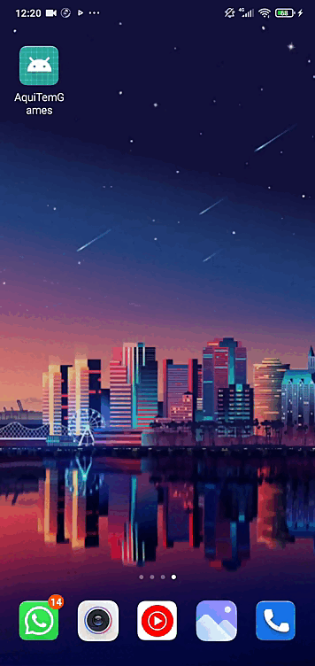
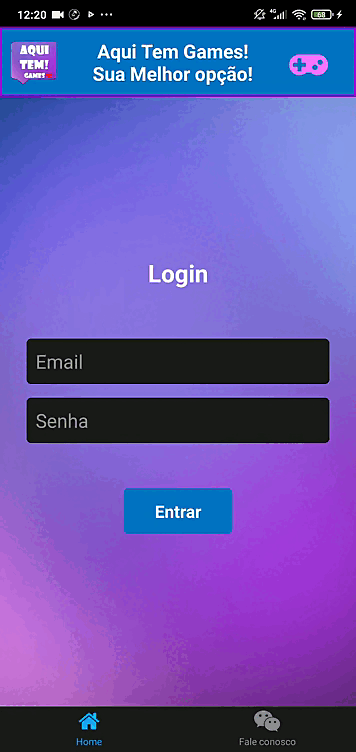
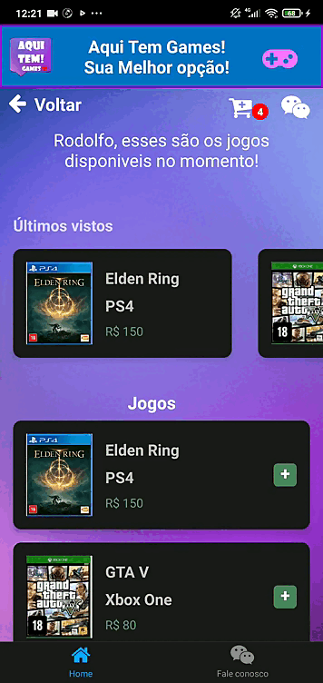

<h1 align=center> Projeto - AquiTemGames</h1>

Projeto em React Native, com aplicação de diversos conceitos como:

Animações e SplashScreen

Context para autentificação e troca de informações entre telas, com aplicação de navegações entre Tabs e Stacks. Aplicação de input para contato com usuário e Scroll para melhor visualização de informações da tela.

Conceitos de WebApi (utilizado uma FakeApi) para armazenar informações do carrinho do cliente

Delete de informações do carricnho ao finalizar a compra, utilizado Alert para comunicação com o usuário

Dentre outros como Hocks, Mocks, controle de rotas e Clean Code.

<h1 align=center> Rodolfo Felis </h1>

